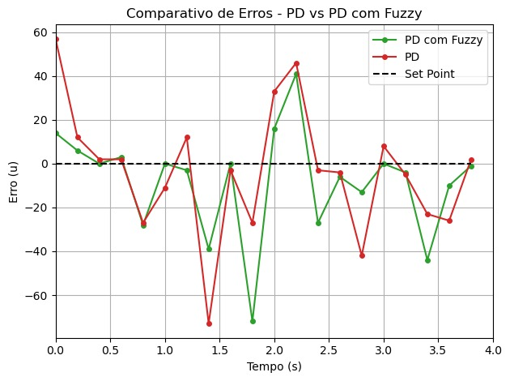

# Tópicos-Avançados-em-Controle

Este repositório foi criado para guardar o trabalho desenvolvido na matéria
de tópicos Avançados em Controle.

## RESULTADO

Foram realizados dois testes com o robô. No primeiro, ele completou uma volta na pista utilizando apenas o controlador PD. No segundo, a volta foi feita com o controlador PD ajustado dinamicamente por um controlador Fuzzy. Durante os testes, foram coletados 20 valores de erro com uma frequência de amostragem de 0,2 segundos. A Figura apresenta a comparação entre os erros registrados na primeira e na segunda volta, evidenciando a diferença no desempenho com e sem o controlador Fuzzy.

No primeiro teste, o robô levou 3,95 segundos para completar a volta, com uma média do módulo do erro de 20,9. Já no segundo teste, com o ajuste Fuzzy ativo, o tempo de volta foi reduzido para 3,8 segundos, e a média do módulo do erro caiu para 16,35. Isso representa uma melhora de 0,15 segundos no tempo de percurso, além de uma maior precisão no seguimento da linha.
